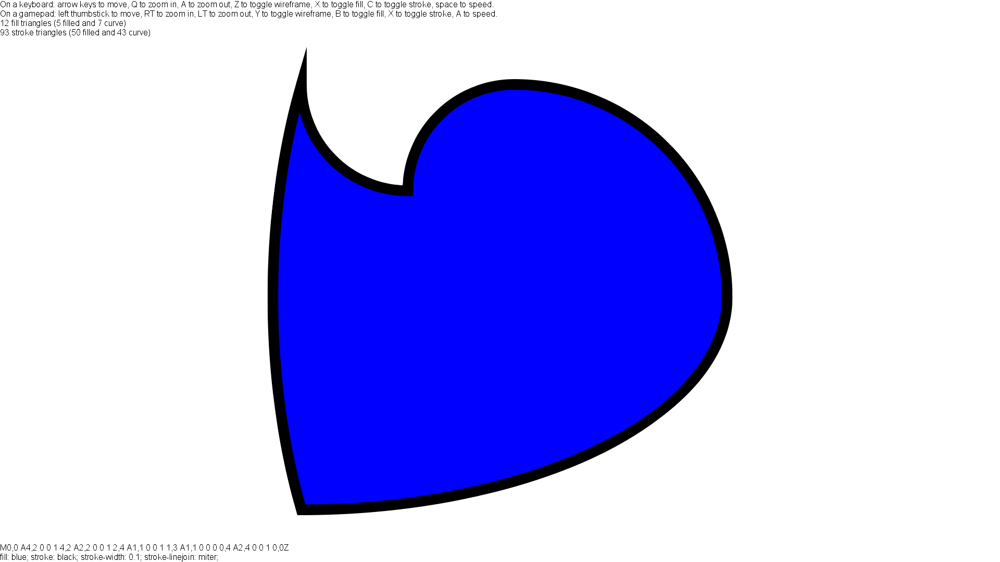
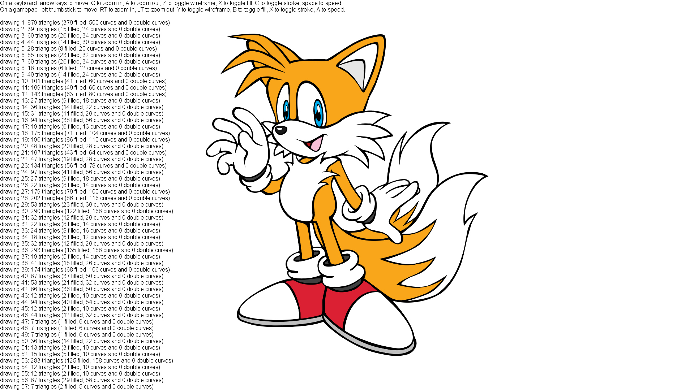

# PathRenderingLab

Welcome to my laboratory on vector graphics!

## What is this repository?

This repository aims to do research on vector graphics rendering and to (possibly) build a content pipeline extension library for [MonoGame](http://www.monogame.net/), in order to viabilize the use and construction of vector SVG files in video games. Vector graphics has the advantage of being infinitely scalable, meaning it will seem crisp and sharp on any resolution, from the smallest ones to the largest ones.

The idea is to preprocess the path data, transforming it into graphics primitives, and sending them to the GPU alongside the required fragment shader in order to let it do the heavy lifting to correctly render the curves and straight lines. For that, three primitive types are used, which I call _triangles_, _curve triangles_ and _double curve triangles_.

 * The _triangles_ are simple primitives which only store the position of the vertices, used to render the completely filled portions of the curve. Because of that, since they store only positional data, they can be cached and indexed, reducing their footprint on memory.
 * The _curve triangles_ are also equipped with carefully-crafted curve coordinates that correspond to special lines on the projective space (more info on [Loop--Blinn](https://www.microsoft.com/en-us/research/wp-content/uploads/2005/01/p1000-loop.pdf)). Those primitives, when equipped with the appropriate fragment shader, will render the Bézier curves as implicit curves on the projective space.
 * The _double curve triangles_ are similar to the curve triangles, but they carry curve coordinates for _two_ curves instead of one. They are required on some edge cases that would be extremely difficult or impossible to properly subdivide and triangulate (like common endpoint curves with the same tangent).

The core of this project is to convert the path representation according to the [SVG Specification on Paths](https://svgwg.org/svg2-draft/paths.html) into the adequate primitives to send to the GPU. This part is almost entirely done. The next part is parse the SVG file to gather the paths and be able to correctly render an entire SVG file -- thus making it available to be drawn on MonoGame projects. The project is still a work in progress, and I do not consider it reaching even into alpha.

## How do I run the current project?

Before, you needed a specially-crafted _path specification file_ to run an example. However, this new commit adds the possibility to specify simple SVG files. Unfortunately, the SVG support is not complete yet, but it already suport solid colors, linear and radial gradients. Support for shadow DOM and clipping and the rest might be coming soon.

## Screenshots

## How can I help?

You want to help? You are absolutely welcome! You can signal issues using the Issues panel or fork my repository and then make my pull request.

## License

The entirety of this project (without the _Bitlush.AvlTree_ folder) is under the MIT license, copyright 2018--2019 João Baptista de Paula e Silva.

With the exception of some SVG files on the example folder (namely, _sonic.svg_, _tails.svg_ and _knuckles.svg_, which I guess configure fair use for the sake of testing this project), all the other SVG files are free to use and in public domain.

## References

1. [Resolution Independent Curve Rendering using Programmable Graphics Hardware](https://www.microsoft.com/en-us/research/wp-content/uploads/2005/01/p1000-loop.pdf)
