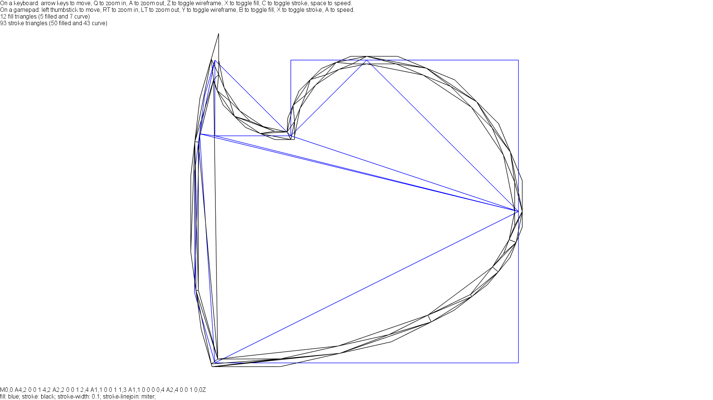
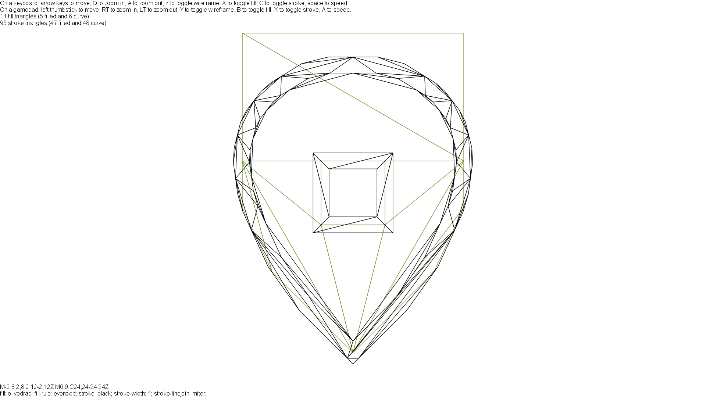

# PathRenderingLab

Welcome to my laboratory on vector graphics!

## What is this repository?

This repository aims to do research on vector graphics rendering and to (possibly) build a content pipeline extension library for [MonoGame](http://www.monogame.net/), in order to viabilize the use and construction of vector SVG files in video games. Vector graphics has the advantage of being infinitely scalable, meaning it will seem crisp and sharp on any resolution, from the smallest ones to the largest ones.

The idea is to preprocess the path data, transforming it into graphics primitives, and sending them to the GPU alongside the required fragment shader in order to let it do the heavy lifting to correctly render the curves and straight lines. For that, two primitive types are used, which I call _triangles_ and _curve triangles_.

 * The _triangles_ are simple primitives which only store the position of the vertices, used to render the completely filled portions of the curve. Because of that, since they store only positional data, they can be cached and indexed, reducing their footprint on memory.
 * The _curve triangles_ are also equipped with carefully-crafted texture coordinates that correspond to special lines on the projective space (more info on [Loop--Blinn](https://www.microsoft.com/en-us/research/wp-content/uploads/2005/01/p1000-loop.pdf)). Those primitives, when equipped with the appropriate fragment shader, will render the Bézier curves as implicit curves on the projective space.

The core of this project is to convert the path representation according to the [SVG Specification on Paths](https://svgwg.org/svg2-draft/paths.html) into the adequate primitives to send to the GPU. This part is almost entirely done. The next part is parse the SVG file to gather the paths and be able to correctly render an entire SVG file -- thus making it available to be drawn on MonoGame projects. The project is still a work in progress, and I do not consider it reaching even into alpha.

## How do I run the current project?

You can test the path processor using a locally specified _path specification file_. It is just a text file with two lines: the first line is the path commands according to the SVG Specification above link (the string you would put on the `d` attribute); the second file are the style attributes, what you would put on the `style` attribute. Currently, the attributes accepted are only `fill`, `fill-rule`, `stroke`, `stroke-width`, `stroke-linejoin`, `stroke-linecap` and `stroke-miterlimit` (and not every `stroke-linejoin` is supported, most notably the `arcs` one is not), and also `background` to set the background color. Furthermore, you would like to set `invert-y` attribute to `yes` depending on where you are copying the path data from. You can find examples of well-formed path specification files on the _examples_ folder.

Example of a path specification file:
```
M 20 10 L 30 10 Q 40 10 40 0 40 -10 30 -10 L 20 -10 Q 10 -10 10 -20 L 10 -30 Q 10 -40 0 -40 -10 -40 -10 -30 L -10 -20 Q -10 -10 -20 -10 L -30 -10 Q -40 -10 -40 0 -40 10 -30 10 L -20 10 Q -10 10 -10 20 L -10 30 Q -10 40 0 40 10 40 10 30 L 10 20 Q 10 10 20 10 Z
fill: teal; stroke: black; stroke-width: 4;
```
Once you have a path specification file, just drag it to the icon of the compiled executable (the more technically-oriented ones can also call the program with the file as only argument), or launch the file (possibly with Visual Studio) and wait for the program to ask you the path of the path specification file. The program will then process the app and launch the viewer. You can navigate through the preprocessed path according to the instructions in the screen.

## Screenshots







## How can I help?

You want to help? You are absolutely welcome! You can signal issues using the Issues panel or fork my repository and then make my pull request.

## License

The entirety of this project (without the _Bitlush.AvlTree_ folder) is under the MIT license, copyright 2018--2019 João Baptista de Paula e Silva.

## References

1. [Resolution Independent Curve Rendering using Programmable Graphics Hardware](https://www.microsoft.com/en-us/research/wp-content/uploads/2005/01/p1000-loop.pdf)